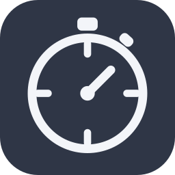

# Laps

A stopwatch with lap times for RemNote.

Every document has a key. Laps are recorded against that key, and the totals roll
up through every folder above it. Ask a folder how much time it has and it
answers for everything underneath it, without you adding anything up.




## Main Features

* Per document lap timer
* Tracking per document, rolls all the way up to any folder or all folders to track your study habits.
* Lap goal tracking: Want to set a lap/time max for studying on a particular document? No problem!
* Edit/mange/delete times

## What it does

A stopwatch pill sits under the Add Template button. Click it and the hands start
moving, one revolution a minute, with a two tone chip beside it showing the lap
number on the left and the running time on the right. Lap records a split and
starts the next one. Stop writes the run away, including the part lap that was in
progress. Drag the stopwatch to put the whole thing somewhere else.

Right click any Rem and pick Laps to open the stats page for it. On a folder that
covers the folder and everything below it, which answers "how long have I spent
anywhere under here". On a document it covers that document alone. Two tabs:

- Laps lists every lap grouped by run, with the split, when it was recorded, and
  Edit and Delete on each row. Editing changes only the lap you touched.
- Chart plots either time per day or individual lap times. Hover for the numbers,
  click a bar to filter to that day, and set any From and To dates you like
  across everything that has ever been recorded.

The Change scope button opens the rollup tree, where you can pick any level:
a single document, a folder, or everything.

## Moving the stopwatch

Drag the stopwatch itself to put it wherever you want. The position is one
setting for the whole knowledge base, not one per document, and it survives a
restart. A press that turns into a drag will not also start the timer.

It is stored as an offset from wherever the placement setting would have put it,
so it stays tied to the document header rather than floating over the page. If
it ends up somewhere awkward, run "Laps: Reset the stopwatch position".

The position lives in local storage rather than synced storage, so each device
keeps its own. A pixel offset that suits a desktop is wrong on a phone.

## Settings

Under Settings, Plugins, Laps.

| Setting | What it changes |
| --- | --- |
| Use default colours | Ignores your choices below and uses the shipped palette. Turn it back off to get your own settings back. |
| Accent shade | The running stopwatch, the chart line, and the primary buttons. |
| Fastest lap shade | Highlight for the quickest lap in a run. |
| Slowest lap shade | Highlight for the slowest lap in a run. |
| Shade intensity | How strongly the row highlights and chart fills are painted. |
| Highlight fastest and slowest laps | Turns the two highlights off entirely. |
| Where to show the stopwatch | In the document, in the top bar, or both. |
| Stopwatch placement in the document | Under Add Template by default, which gives it a full row. Inline shares the title row, which is tighter. |
| Show milliseconds | Adds thousandths to the running chip. Recorded laps keep full precision either way. |
| The lap chip counts | Time on the current lap, or total elapsed since the start. |

Ten shades are available, each with its own light and dark pair rather than one
colour lightened or darkened, so amber does not go muddy on a dark ground and the
deep blues keep their separation on a light one.

## Commands

Press Ctrl+K and type "laps".

| Command | What it does |
| --- | --- |
| Laps: Show lap times and charts | Opens the stats page for whatever is selected |
| Laps: Show everything | Opens the stats page across the whole knowledge base |
| Laps: Total time on this item | Toasts the rolled up total for the current item |
| Laps: Reset the stopwatch position | Undoes a drag |
| Laps: Show current settings | Toasts the settings actually in effect |
| Laps: Copy debug info | Puts a full report on the clipboard for a bug report |

## Where the data lives

Completed runs go in RemNote's synced plugin storage and follow you between
devices. Laps are written as they happen rather than only at Stop, so a crash
costs the lap in progress and nothing before it.

The stopwatch currently running is kept in local storage instead, because a timer
running on your laptop should not read as running on your phone. Only one runs at
a time. Starting a second one somewhere else is refused rather than silently
stopping the first, which is a measurement you are in the middle of taking.

Each session stores the path it was recorded at rather than looking it up again
later. Moving or deleting a document would otherwise change or lose its history,
and last month's totals should stay put.

## Screenshots

### Lap Management


## Document/ Folder scope

Per document, rolls all the way up to any folder or all folders to track your study habits.


## Setting goals

Want to set a lap/time max for studying on a particular document? No problem!


## Development

```bash
npm install
npm run dev
```

Then in RemNote: Settings, Plugins, Build, Develop from localhost,
`http://localhost:8080`.

The dev build renames itself to `remnote-laps-dev` and "Laps (dev)" on the way
into the bundle, which lets it load alongside the released plugin. The checked in
manifest keeps the real id.

```bash
npm test           # unit tests, no RemNote needed
npm run check-types
npm run verify     # both of the above
npm run build      # produces LapsPlugin.zip
```

## Licence

MIT.
